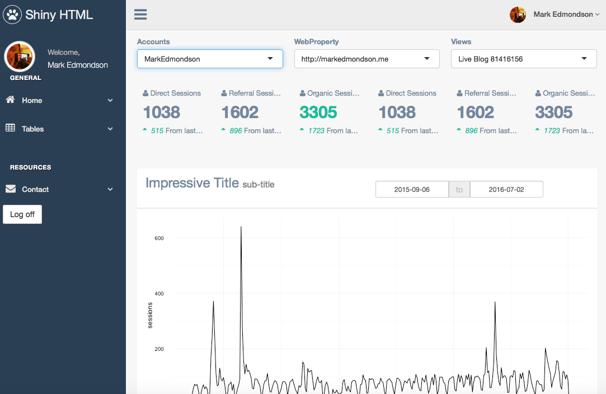

# gentelellaShiny

This is a R [Shiny HTML Template](http://shiny.rstudio.com/articles/templates.html) version of the [gentelella bootstrap theme](https://github.com/puikinsh/gentelella).

## Features

* A unique looking Shiny dashboard
* Login authentication page (requires [`googleAuthR`](https://github.com/MarkEdmondson1234/googleAuthR))
* Profile name and picture pulled from G+ (requires [`googleID`](https://github.com/MarkEdmondson1234/googleID))
* Dynamic headline tiles
* Dynamic progress bar visualisation
* Custom box for plots including date picker in header
* Custom collapsible box for dashboard elements

## Screenshot after logging in

The demo uses `googleAnalyticsR` to download data, so won't look like much if you login with an account with no GA :)  Replace with your own data source and everything else will work though. 



## To use

HTML templates uses `shiny::htmlTemplate` in the `ui.R` to add dynamic content to the `index.html` file

An example ui.R:

```r
htmlTemplate("index.html",
             googleLogin = column(width = 12, googleAuthR::googleAuthUI("auth")),
             authDropdown = column(width = 12, googleAnalyticsR::authDropdownUI("auth_dropdown")),
             sessionTable = graph_box(dataTableOutput("delta")),
             topTiles = tileCountRow(tileCountUI("e1"), tileCountUI("e2"), tileCountUI("e3"),
                                     tileCountUI("e4"), tileCountUI("e5"), tileCountUI("e6")),
             graph_box = graph_box(),
             another_box = dashboard_box(uiOutput("progress_bar2")),
             another_box2 = dashboard_box(p("Interesting stuff goes here")),
             another_box3 = dashboard_box(p("More interesting stuff")),
             profile = uiOutput("profile"),
             profile_nav = uiOutput("profile_nav"),
             progress_bar = uiOutput("progress_bar")
)
```

Edit into `index.html` where the dynamic content should appear within two curly brackets `{{ googleLogin }}`

### Login page

`googleAuthUI` creates a login URL that includes a security code.  

Set the security code to be static (default it changes each launch of `googleAuthR`) via options, e.g. `options(googleAuthR.securitycode = "gentelellXXXXXXX")` in the top of `server.R`

Generate the login URL with the security code, and use as the login link in the `./www/production/login.html` file.


The `login.html` file can then be used, with `index.html` holding logic to not show content without logging in.
