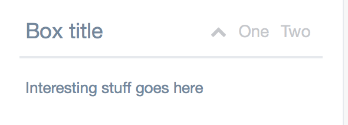

# gentelellaShiny

This is an R [Shiny HTML Template](http://shiny.rstudio.com/articles/templates.html) version of the [gentelella bootstrap theme](https://github.com/puikinsh/gentelella).

It will eventually become a package.

## Features

* A unique looking Shiny dashboard
* Login authentication page (requires [`googleAuthR`](https://github.com/MarkEdmondson1234/googleAuthR))
* Profile name and picture pulled from G+ (requires [`googleID`](https://github.com/MarkEdmondson1234/googleID))
* Dynamic headline tiles
* Dynamic progress bar visualisation
* Custom box for plots including date picker in header
* Custom collapsible box for dashboard elements

## Screenshot after logging in

The demo uses `googleAnalyticsR` to download data, so won't look like much if you login with an account with no GA :)  Replace with your own data source and everything else will work though. 


## Elements

* googleanalytics dropdown

From `googleAnalyticsR`, a UI to selet GA view:


* Top tiles

A tile to show headline metrics


* Plot Box

A box with datepicker for plots


* Collapsible box

A box to display other dashboard content




## To use

A special function `gentelellaPage()` has been created that you pass normal ui.R elements to, that will then render each parameter in order to each row of content on the page.

If you want more items to appear in one row, then pass them in a `shiny::tagList`

Example:

```r
boxRow <- tagList(
  dashboard_box(uiOutput("progress_bar2")),
  dashboard_box(p("Interesting stuff goes here")),
  dashboard_box(p("More interesting stuff"))
)

## each parameter holds UI elements that are rendered in order down the content page
gentelellaPage(
  authDropdown = column(width = 12, googleAnalyticsR::authDropdownUI("auth_dropdown")),
  topTiles = tileCountRow(tileCountUI("e1"), tileCountUI("e2"), tileCountUI("e3"),
                          tileCountUI("e4"), tileCountUI("e5"), tileCountUI("e6")),
  graph_box1 = graph_box(dygraphOutput("trend_plot"),
                         datepicker = dateRangeInput("datepicker_id", NULL, start = Sys.Date() - 300)),
  another_box =  boxRow
)

```

This will then populate the `index.html` file via `shiny::htmlTemplate`, so you shouldn't need to touch the HTML yourself. 

`gentelellaPage` also includes some reserved parameters to set options such as sidebar menu items, title tag and footer images.

```r
## create menu items for sidebar using sidebarElement
menuItems <- list(
  sideBarElement(" Home ",
                 icon = icon("home"),
                 list(a(href="index.html", "Dashboard"),
                      a(href="index2.html", "Dashboard2"),
                      a(href="index3.html", "Dashboard3"))                        
  ),
  sideBarElement(" Contact ",
                 icon = icon("envelope"),
                 list(a(href="http://twitter.com/HoloMarkeD", 
                        HTML(paste(icon("twitter"), "@HoloMarkeD"))),
                      a(href="http://code.markedmondson.me", 
                        HTML(paste(icon("rss"), " Blog"))),
                      a(href="https://github.com/MarkEdmondson1234/gentelellaShiny", 
                        HTML(paste(icon("github"), " Github"))))                        
  ),
  sideBarElement(column(width = 12, googleAuthR::googleAuthUI("auth"),
                        icon = NULL)
  ))

gentelellaPage(
  topTiles = tileCountRow(tileCountUI("e1"), tileCountUI("e2"), tileCountUI("e3"),
                          tileCountUI("e4"), tileCountUI("e5"), tileCountUI("e6")),
  
  ## start reserved parameters:
  menuItems = menuItems,
  title_tag = "Shiny HTML Template",
  site_title = a(class="site_title", icon("eye"), span("Shiny HTML")),
  footer = "Made in Denmark"
)
```

There is no other support for different layouts other than the defaults in `gentelellaPage()`, in that case use `shiny::htmlTemplate` directly and edit `index.html` to include your R code blocks in `{{ brackets }}`

### Login page

`googleAuthUI` creates a login URL that includes a security code.  

Set the security code to be static (default it changes each launch of `googleAuthR`) via options, e.g. `options(googleAuthR.securitycode = "gentelellXXXXXXX")` in the top of `server.R`

Generate the login URL with the security code, and use as the login link in the `./www/production/login.html` file.


The `login.html` file can then be used, with `index.html` holding logic to not show content without logging in.
